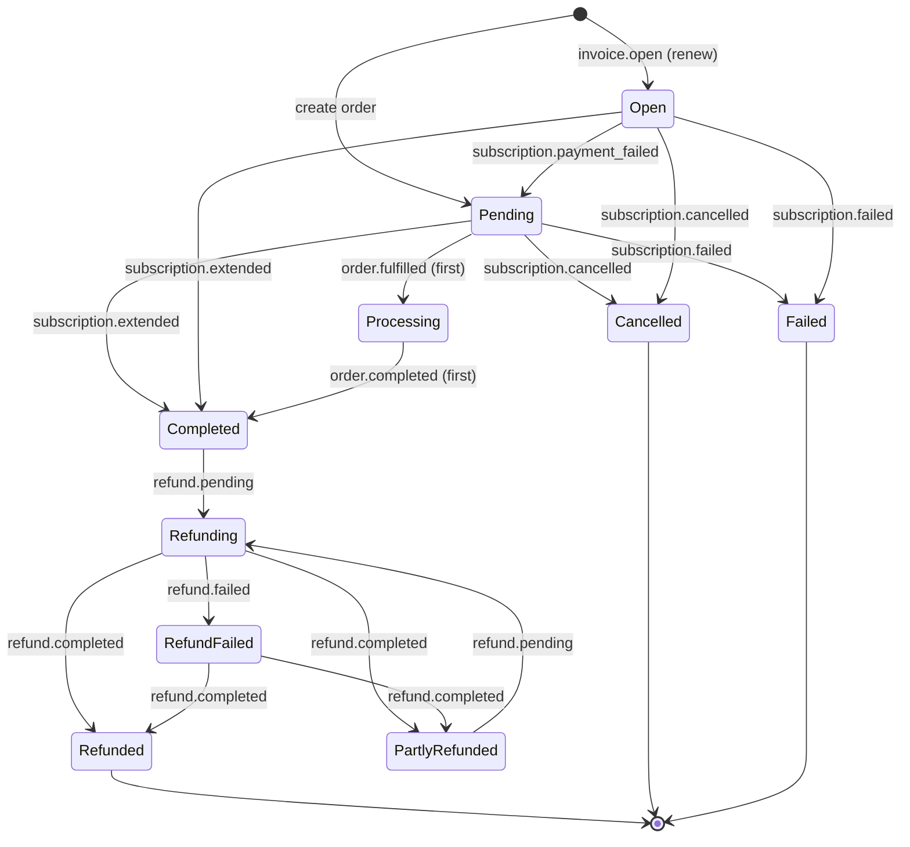

# Invoice

## State Diagram

```mermaid
stateDiagram-v2
  [*]
  [*]           --> Pending         : create order
  [*]           --> Open            : invoice.open (renew)

  Pending       --> Failed          : subscription.failed
  Pending       --> Completed       : subscription.extended
  Pending       --> Cancelled       : subscription.cancelled
  Pending       --> Processing      : order.fulfilled (first)
  
  Open
  Open          --> Failed          : subscription.failed
  Open          --> Pending         : subscription.payment_failed
  Open          --> Completed       : subscription.extended
  Open          --> Cancelled       : subscription.cancelled

  Processing    --> Completed       : order.completed (first)

  Completed
  Completed     --> Refunding       : refund.pending

  Refunding 
  Refunding     --> Refunded        : refund.completed
  Refunding     --> PRefunded       : refund.completed
  Refunding     --> RefundFailed    : refund.failed

  RefundFailed
  RefundFailed  --> Refunded        : refund.completed
  RefundFailed  --> PRefunded       : refund.completed

  PRefunded: PartlyRefunded
  PRefunded     --> Refunding       : refund.pending
  
  Refunded      
  Refunded      --> [*]

  Cancelled     --> [*]

  Failed
  Failed        --> [*]

```
