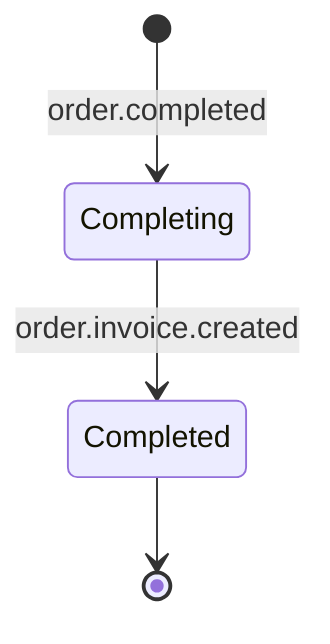
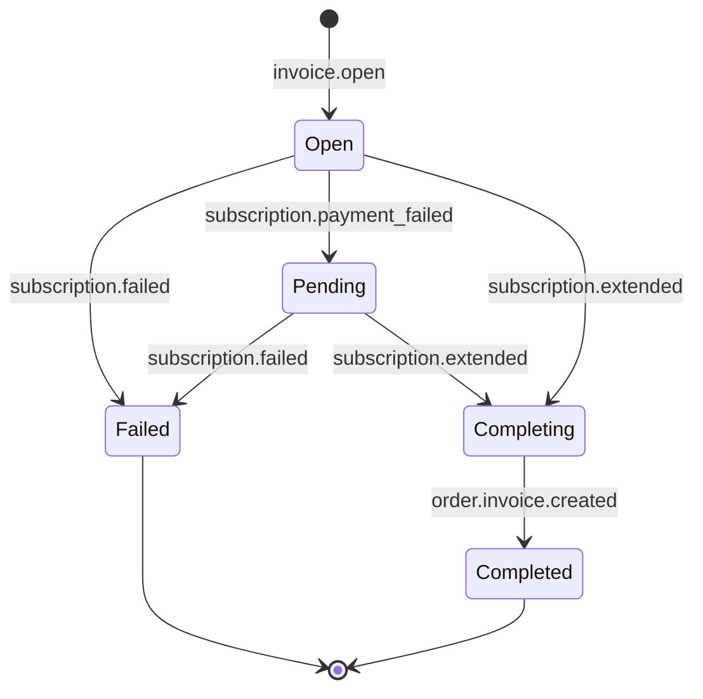

# Invoice

## State Diagram (first invoice)

```mermaid
stateDiagram-v2
  [*]
  [*]           --> Completing      : order.completed

  Completing
  Completing    --> Completed       : order.invoice.created

  Completed
  Completed     --> [*]

```

## State Diagram (renew invoice)

```mermaid
stateDiagram-v2
  [*]
  [*]           --> Open            : invoice.open

  Open
  Open          --> Failed          : subscription.failed
  Open          --> Pending         : subscription.payment_failed
  Open          --> Completing      : subscription.extended

  Pending       --> Failed          : subscription.failed
  Pending       --> Completing      : subscription.extended
  
  Completing
  Completing    --> Completed       : order.invoice.created

  Completed
  Completed     --> [*]

  Failed
  Failed        --> [*]

```
