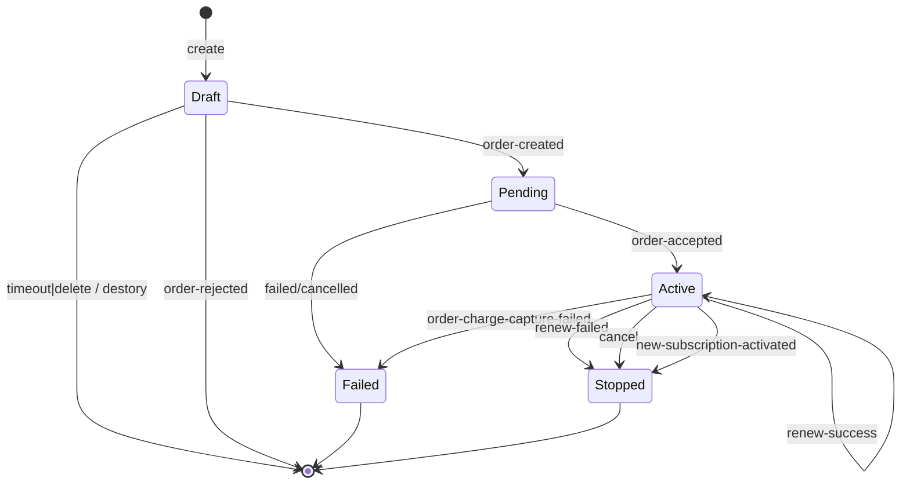
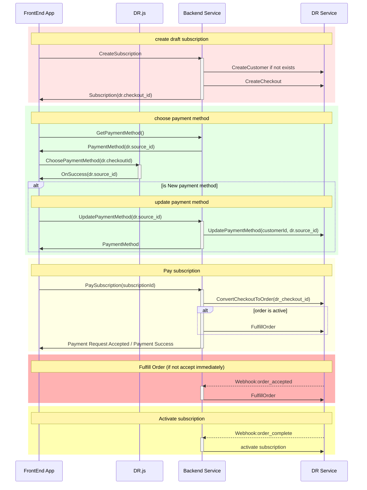

# Subscription

## State Diagram

```mermaid
stateDiagram-v2
  [*]
  [*]           --> Draft         : create

  Draft
  Draft         --> Pending       : order-created
  Draft         --> [*]           : timeout|delete / destory
  Draft         --> [*]           : order-rejected

  Pending
  Pending       --> Active        : order-accepted
  Pending       --> Failed        : failed/cancelled

  Active
  Active        --> Failed        : order-charge-capture-failed
  Active        --> Active        : renew-success
  Active        --> Stopped       : renew-failed
  Active        --> Stopped       : cancel
  Active        --> Stopped       : new-subscription-activated

  Failed
  Failed        --> [*]

  Stopped
  Stopped       --> [*]
```

## Sequence Diagram

```mermaid
sequenceDiagram
participant App as FrontEnd App
participant DRJS as DR.js
participant BE as Backend Service
participant DR as DR Service

rect rgba(255,0,0,0.1)
note over App, DR: create draft subscription
App->>BE: CreateSubscription
activate BE
BE->>DR: CreateCustomer if not exists
BE->>DR: CreateCheckout
BE->>App: Subscription(dr.checkout_id)
deactivate BE
end

rect rgba(0,255,0,0.1)
note over App, DR: choose payment method
App->>BE: GetPaymentMethod()
BE->>App: PaymentMethod(dr.source_id)
App->>DRJS: ChoosePaymentMethod(dr.checkoutId)
activate DRJS
DRJS->>App: OnSuccess(dr.source_id)
deactivate DRJS

alt is New payment method
  note over App, DR: update payment method
  App->>BE: UpdatePaymentMethod(dr.source_id)
  activate BE
  BE->>DR: UpdatePaymentMethod(customerId, dr.source_id)
  BE->>App: PaymentMethod
  deactivate BE
  end
end 

rect rgba(255,255,0,0.1)
note over App, DR: Pay subscription
App->>BE: PaySubscription(subscriptionId)
activate BE
BE->>DR: ConvertCheckoutToOrder(dr_checkout_id)
alt order is active
  BE->>DR: FulfillOrder
end
BE->>App: Payment Request Accepted / Payment Success
deactivate BE
end 

rect rgba(255,0,0,0.3)
note over App, DR: Fulfill Order (if not accept immediately)
DR-->>BE: Webhook:order_accepted
activate BE
BE->>DR: FulfillOrder
deactivate BE
end

rect rgba(255,255,0,0.3)
note over App, DR: Activate subscription
DR-->>BE: Webhook:order_complete
activate BE
BE->>DR: activate subscription
deactivate BE
end
```
