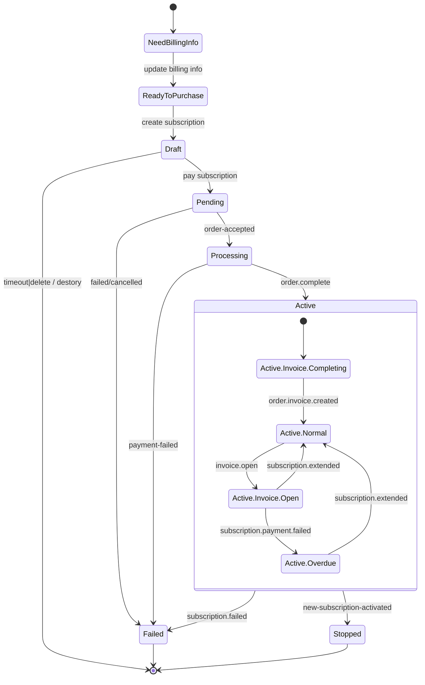

# Subscription

## Test Scenarios

```mermaid
stateDiagram-v2
  [*]
  [*]           --> NeedBillingInfo

  NeedBillingInfo
  NeedBillingInfo   --> ReadyToPurchase       : update billing info

  ReadyToPurchase
  ReadyToPurchase   --> Draft     : create subscription

  
  Draft
  Draft   --> Pending             : pay subscription
  Draft   --> [*]                 : timeout|delete / destory
  
  Pending
  Pending       --> Processing    : order-accepted
  Pending       --> Failed        : failed/cancelled

  Processing
  Processing    --> Active        : order.complete
  Processing    --> Failed        : payment-failed 

  state Active {
  [*]                         --> Active.Invoice.Completing
  Active.Invoice.Completing   --> Active.Normal               : order.invoice.created
  Active.Normal               --> Active.Invoice.Open         : invoice.open
  Active.Invoice.Open         --> Active.Overdue              : subscription.payment.failed
  Active.Invoice.Open         --> Active.Normal               : subscription.extended
  Active.Overdue              --> Active.Normal               : subscription.extended
  }
  Active        --> Stopped       : new-subscription-activated
  Active        --> Failed        : subscription.failed

  Failed
  Failed        --> [*]

  Stopped
  Stopped     --> [*]
```

