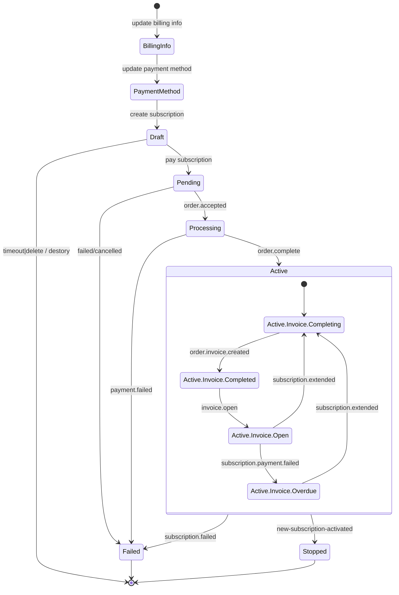

# Subscription

## Test Scenarios

```mermaid
stateDiagram-v2
  [*]
  [*]                       --> BillingInfo               : update billing info

  BillingInfo
  BillingInfo               --> PaymentMethod             : update payment method

  PaymentMethod
  PaymentMethod             --> Draft                     : create subscription

  
  Draft
  Draft                     --> Pending                   : pay subscription
  Draft                     --> [*]                       : timeout|delete / destory
  
  Pending
  Pending                   --> Processing                : order.accepted
  Pending                   --> Failed                    : failed/cancelled

  Processing
  Processing                --> Active                    : order.complete
  Processing                --> Failed                    : payment.failed 

  state Active {
  [*]                       --> Active.Invoice.Completing
  Active.Invoice.Completing --> Active.Invoice.Completed  : order.invoice.created
  Active.Invoice.Completed  --> Active.Invoice.Open       : invoice.open
  Active.Invoice.Open       --> Active.Invoice.Overdue    : subscription.payment.failed
  Active.Invoice.Open       --> Active.Invoice.Completing : subscription.extended
  Active.Invoice.Overdue    --> Active.Invoice.Completing : subscription.extended
  }
  Active                    --> Stopped                   : new-subscription-activated
  Active                    --> Failed                    : subscription.failed

  Failed
  Failed                    --> [*]

  Stopped
  Stopped                   --> [*]
```

